# AeroSentinel — Holistic Aircraft Predictive Maintenance
> Transcending Turbofan Prognostics for Fleet-Wide Asset Management

## 🎯 Problem Statement — A To Z

### What Is This Problem?
Aviation maintenance currently operates under three paradigms:
1. **Scheduled maintenance:** Fixed time/flight-hour intervals regardless of actual component condition, resulting in premature part replacement and wasted life.
2. **Reactive (run-to-failure):** Waiting for a fault to occur, causing highly disruptive Aircraft on Ground (AOG) events that cost up to $150,000 per hour.
3. **Predictive maintenance:** Using continuous sensor telemetry and machine learning to forecast Remaining Useful Life (RUL) of components, enabling "just-in-time" interventions. 

The goal of this project is to build a Predictive Health Management (PHM) system that operates across the **entire aircraft** — not just turbofan engines — using a multi-modal sensor fusion and ML architecture. It deploys at the edge of the aircraft and communicates actionable results to ground crews via the ACARS datalink.

### Why Is This Hard?
- **Massive Data Scale:** Aircraft generate terabytes of heterogeneous sensor data per flight (thermodynamic, acoustic, kinematic, electrical, textual).
- **Masked Degradation:** Subsystems like the Environmental Control System (ECS) are governed by closed-loop controllers that actively mask degradation signals.
- **Scarce Real Data:** True "run-to-failure" data for safety-critical components is incredibly rare due to aviation safety protocols.
- **Domain Shift:** Different operating conditions (e.g., humid vs. dry routes) drastically change sensor distributions, breaking standard ML models.
- **Bandwidth Constraints:** ACARS bandwidth is limited to 220 characters per message block, mandating that all heavy ML inference occurs onboard at the edge.

## 💡 The Solution: Beyond the Turbofan

Most predictive maintenance solutions stop at the turbofan engine (relying on synthetic data like C-MAPSS). **AeroSentinel is different.** We built a 6-layer multi-domain ensemble architecture combining 9+ real-world and research datasets to monitor **12 physical aircraft subsystems**.

| Dimension | Baseline (Turbofan Only) | AeroSentinel (Whole Aircraft) |
| :--- | :--- | :--- |
| **Systems Covered** | Turbofan engine only | 12 subsystems across the entire airframe |
| **Data Modalities** | Thermodynamic variables | Thermo + Acoustic + Kinematic + Electrical + NLP Text |
| **Cross-System Coupling** | Not modeled | Explicitly handles interactions (e.g., ECS ↔ Engine) |
| **Deployment Target** | Single cloud model | Edge (ONNX/TensorRT) multi-model ensemble |

Unlike isolated models, our system performs **cross-subsystem correlation analysis**, preventing misdiagnoses (e.g., ECS failure masquerading as an engine fault).

Key innovations:
- **Edge Inference:** ONNX/TensorRT quantization achieving sub-5ms latency.
- **NLP Integration:** Fine-tuned LLaMA-3.2 / Gemma-3 models trained on the MaintNet corpus for automated repair step recommendations.
- **3D Visualization:** A visually stunning React Three Fiber dashboard displaying fleet-wide health scores and interactive what-if fault simulations.

---

## 🏗️ System Architecture — 6-Layer Multi-Domain Ensemble

> 12 Subsystems · 15.1M+ Data Points · 273 System Variables · 17+ ML Models

```mermaid
graph TD
    subgraph DataSources ["① Multi-Subsystem Data Sources"]
        Engine[Turbofan Engine<br/>NASA C-MAPSS · 21 sensors]
        APU[APU System<br/>EGT · N1 · Vibration]
        ECS[ECS<br/>Boeing 737-200 Thermo]
        LG[Landing Gear<br/>AeroTwin 787 · 15.1M pts]
        Brakes[Carbon Brakes<br/>Brake-core Telemetry]
        EMA[EMA / Actuators<br/>NASA FLEA Testbed]
        Hyd[Hydraulics<br/>UCI · 43,680 features]
        ADAPT[Electrical / ADAPT<br/>273 vars · 128 sensors @ 2Hz]
        Bat[Li-ion Battery<br/>HIRF · 18650 Cells]
        CFRP[Structural / CFRP<br/>NASA Ames · 16 PZT]
        QAR[QAR Telemetry<br/>NGAFID-MC · 11,500 hrs]
        NLPData[Maintenance Logs<br/>MaintNet · 6,169 records]
    end

    subgraph Ingestion ["② Data Ingestion Layer"]
        Thermo[Thermodynamic Streams<br/>1–4 Hz Continuous]
        Kine[Kinematic Telemetry<br/>Velocity / Displacement]
        Acoustic[Acoustic Emissions<br/>PZT Burst Waveforms]
        Avionics[Avionics Bus Electrical<br/>2 Hz Sampling]
        QARStream[QAR Flight Parameters<br/>1 Hz Per-Second]
        NLPLogs[NLP Text Logs<br/>Batch Processing]
    end

    subgraph FeatureEng ["③ Feature Engineering & Preprocessing"]
        Norm[Min-Max + Z-Score Normalization]
        Window[30-Cycle Sliding Window]
        CWT[Continuous Wavelet Transform]
        TFIDF[TF-IDF + SVD / LSA]
        SHAP[SHAP Feature Selection<br/>21 → 14 vars]
        SMOTE[SMOTE Oversampling<br/>Rare Fault Balancing]
        TCA[Transfer Component Analysis<br/>Cross-Domain Alignment]
        Leven[Levenshtein Spell-Check<br/>Aviation Abbreviations]
    end

    subgraph ModelEnsemble ["④ Domain-Specific Model Ensemble"]
        BiLSTM[BiLSTM + Attention<br/>Engine RUL]
        Transformer[Transformer Encoder<br/>Multi-fault FD004]
        BCADATrans[BCA-DATrans<br/>EMA Actuator Faults]
        ConvAE[1D Conv Autoencoder<br/>Hydraulic Anomaly]
        GPR[Gaussian Process Reg.<br/>EMA Spall Prognostics]
        BayesNet[Bayesian Network<br/>503 Nodes · ADAPT · 0.26ms]
        TCN[TCN + Transfer Learning<br/>Battery SOH]
        CNNCWT[CNN on CWT Images<br/>CFRP Delamination]
        ConvMHSA[Conv-MHSA / DUTSAM<br/>QAR Hard-Landing]
        RF[Random Forest + CART<br/>APU Health Scoring]
        LLaMA[LLaMA-3.2-3B<br/>Fine-tuned · MaintNet]
        Gemma[Gemma-3-4B<br/>Fine-tuned · MaintNet]
    end

    subgraph AnomalyEngine ["⑤ Fusion Alert & Anomaly Engine"]
        AnomalyDet[Multivariate Anomaly Detector<br/>Cross-Subsystem Correlation]
        SLIDE[SLIDE Hierarchical Filter<br/>False-Alarm Suppression]
        Kalman[Kalman / Bond Graph Isolation<br/>LRU-Level Fault Pinpoint]
        RULConf[RUL Confidence Interval<br/>Ensemble Uncertainty]
        AOG[AOG Cost Scorer<br/>$150k/hr Probabilistic Risk]
        ACARS[ACARS 220-char Alert Compiler<br/>Compressed Downlink Message]
    end

    subgraph EdgeViz ["⑥ Edge Inference + 3D Visualization"]
        ONNX[ONNX + TensorRT INT8/FP16<br/>Sub-5ms Edge Latency]
        R3F[React Three Fiber 3D Aircraft<br/>WebGL Health Heatmap]
        Recharts[Live Recharts Sensor Streams<br/>Multi-Modal Real-Time]
        WhatIf[What-If Fault Simulator<br/>Inject Faults → RUL Cascade]
        Fleet[Fleet Maintenance Planner<br/>Gantt-Chart Multi-Aircraft]
        NLPRepair[NLP Repair Recommender<br/>LLM Chat Interface]
    end

    Engine --> Thermo
    APU --> Thermo
    ECS --> Thermo
    LG --> Kine
    Brakes --> Kine
    EMA --> Kine
    Hyd --> Thermo
    ADAPT --> Avionics
    Bat --> Avionics
    CFRP --> Acoustic
    QAR --> QARStream
    NLPData --> NLPLogs

    Thermo --> Norm
    Kine --> Norm
    Acoustic --> CWT
    Avionics --> Window
    QARStream --> SHAP
    NLPLogs --> TFIDF
    Norm --> Window
    TFIDF --> Leven

    Window --> BiLSTM
    Window --> Transformer
    SHAP --> BiLSTM
    CWT --> CNNCWT
    SMOTE --> RF
    TCA --> BCADATrans
    Norm --> ConvAE
    Norm --> GPR
    Window --> BayesNet
    Window --> TCN
    Window --> ConvMHSA
    Leven --> LLaMA
    Leven --> Gemma

    BiLSTM --> AnomalyDet
    Transformer --> AnomalyDet
    BCADATrans --> AnomalyDet
    ConvAE --> AnomalyDet
    GPR --> AnomalyDet
    BayesNet --> AnomalyDet
    TCN --> AnomalyDet
    CNNCWT --> AnomalyDet
    ConvMHSA --> AnomalyDet
    RF --> AnomalyDet
    LLaMA --> AnomalyDet
    Gemma --> AnomalyDet

    AnomalyDet --> SLIDE
    SLIDE --> Kalman
    Kalman --> RULConf
    RULConf --> AOG
    AOG --> ACARS

    ACARS --> ONNX
    RULConf --> R3F
    RULConf --> Recharts
    AOG --> WhatIf
    AOG --> Fleet
    LLaMA --> NLPRepair
    Gemma --> NLPRepair

    classDef sources fill:#1e40af,stroke:#fff,stroke-width:2px,color:#fff;
    classDef ingestion fill:#1d4ed8,stroke:#fff,stroke-width:2px,color:#fff;
    classDef feature fill:#7c3aed,stroke:#fff,stroke-width:2px,color:#fff;
    classDef models fill:#dc2626,stroke:#fff,stroke-width:2px,color:#fff;
    classDef anomaly fill:#b45309,stroke:#fff,stroke-width:2px,color:#fff;
    classDef edge fill:#047857,stroke:#fff,stroke-width:2px,color:#fff;

    class Engine,APU,ECS,LG,Brakes,EMA,Hyd,ADAPT,Bat,CFRP,QAR,NLPData sources;
    class Thermo,Kine,Acoustic,Avionics,QARStream,NLPLogs ingestion;
    class Norm,Window,CWT,TFIDF,SHAP,SMOTE,TCA,Leven feature;
    class BiLSTM,Transformer,BCADATrans,ConvAE,GPR,BayesNet,TCN,CNNCWT,ConvMHSA,RF,LLaMA,Gemma models;
    class AnomalyDet,SLIDE,Kalman,RULConf,AOG,ACARS anomaly;
    class ONNX,R3F,Recharts,WhatIf,Fleet,NLPRepair edge;
```



### 🔍 Detailed Architecture Explanation

<details>
<summary><b>① Data Sources — 12 Subsystems, 9+ Datasets</b></summary>

| Subsystem | Dataset | Key Sensors |
| :--- | :--- | :--- |
| Turbofan Engine | NASA C-MAPSS (FD001–FD004) | T2/T24/T30, Ps30, NF/NC shaft speeds (21 sensors) |
| APU | EGT Monitoring / RIF | EGT startup peaks, N1, vibration, bleed pressure |
| ECS | Boeing 737-200 Simulation | T1-T6 temps, P1-P4 pressures, RH, bypass valve |
| Landing Gear | AeroTwin Boeing 787 (15.1M pts) | TP2/TP3 pneumatic, H1 separator, DV valve state |
| Carbon Brakes | Operational Telemetry | Landstrike velocity, aircraft mass, brake-core temp |
| EMA / Actuators | NASA FLEA Testbed | Motor current/voltage, ball-screw spall, parasitic loads |
| Hydraulics | UCI Condition Monitoring (43,680 feat) | PS1-PS6 pressure, TS1-TS4 temp, FS1/FS2 flow, VS1 vibration |
| Electrical / ADAPT | NASA ADAPT (273 vars @ 2Hz) | Relay states, bus voltages/currents, CB positions (128 sensors) |
| Li-ion Battery | HIRF + 18650 Aging | Terminal voltage, current, temperature, impedance |
| Structural / CFRP | NASA Ames SMART Layer | Lamb-wave 1D/2D, phase velocity, 16 PZT sensors |
| QAR Telemetry | NGAFID-MC (11,500 hrs) | GPS alt, pitch, vertical accel, fatigue load (23 params) |
| Maintenance Logs | MaintNet (6,169 records) | "Problem" + "Action" text pairs, abbreviations |

</details>

<details>
<summary><b>④ Model Ensemble — 17+ Specialized Models</b></summary>

| Model | Subsystem Target | Output |
| :--- | :--- | :--- |
| BiLSTM + Attention | Engine (C-MAPSS) | RUL (cycles to failure) |
| Transformer Encoder | Engine FD004 (multi-fault) | RUL (multi-condition) |
| Random Forest + CART | APU health classification | Health index, EGT margin alert |
| TCA / JDA | ECS cross-condition adaptation | Heat-exchanger efficiency Δ |
| XGBoost + SMOTE | Landing Gear bushing wear | Bushing wear class, overhaul date |
| BCA-DATrans | EMA actuator faults | Spall size, jam probability |
| 1D Conv Autoencoder | Hydraulic anomaly detection | Pump leak severity, valve lag |
| Bayesian Network (503 nodes) | Electrical fault isolation | Fault isolation in 0.26ms |
| TCN + Transfer Learning | Li-ion battery SOH | SOH, Remaining Flying Time |
| CNN on CWT Spectrograms | CFRP delamination | Delamination size, structural RUL |
| Conv-MHSA / DUTSAM | QAR flight telemetry | Hard-landing flag, fatigue load |
| LLaMA-3.2-3B (fine-tuned) | Maintenance log parsing | Repair step recommendation |
| Gemma-3-4B (fine-tuned) | Maintenance log parsing | Repair step recommendation |
| Gaussian Process Regression | EMA spall prognostics | RUL with uncertainty bounds |
| Bayesian Particle Filter | Structural SHM | Probabilistic RUL update |

</details>

---

## 🛠️ Full Technology Stack

- **Frontend / Visualization:** Next.js 14 (App Router), React Three Fiber (WebGL), Recharts, Tailwind CSS, Zustand, TypeScript
- **Backend API:** FastAPI (Python), WebSocket Live Streaming, Pydantic, Uvicorn
- **ML / AI Layer:** PyTorch, ONNX Runtime, TensorRT INT8 Quantization, scikit-learn, HuggingFace Transformers
- **Data Processing:** Pandas, NumPy, SciPy, PyWavelets, SHAP, SMOTE, spaCy
- **Edge / Deployment:** ONNX Runtime, Vercel / Railway cloud deploy, Docker

---

## 🚀 How to Run the Project

### Prerequisites
- Python 3.10+
- Node.js 20+
- Git

### Mac OS
```bash
# 1. Clone the repository
git clone https://github.com/diiyeah/AeroSentinal.git
cd AeroSentinal

# 2. Setup Python Virtual Environment & Install Dependencies
python3 -m venv .venv
source .venv/bin/activate
pip install -r requirements.txt

# 3. Data Setup
python scripts/download_data.py
python scripts/generate_synthetic.py

# 4. Start the Backend API
python -m uvicorn backend.app.main:app --reload --port 8000 &

# 5. Start the Frontend Dashboard (in a new terminal)
cd frontend
npm install
npm run dev
```

### Windows
```powershell
# 1. Clone the repository
git clone https://github.com/diiyeah/AeroSentinal.git
cd AeroSentinal

# 2. Setup Python Virtual Environment & Install Dependencies
python -m venv .venv
.venv\Scripts\activate
pip install -r requirements.txt

# 3. Data Setup
python scripts/download_data.py
python scripts/generate_synthetic.py

# 4. Start the Backend API
start "Backend" cmd /c "python -m uvicorn backend.app.main:app --reload --port 8000"

# 5. Start the Frontend Dashboard
cd frontend
npm install
npm run dev
```

---

## 🗺️ Implementation Roadmap

### 🏁 Prototype Round
The prototype round focuses on building the core foundation and multi-system framework.
- **Phase 1 (Foundation):** Load NASA C-MAPSS data, train the baseline BiLSTM+Attention engine model, build the FastAPI backend, and construct a basic Next.js dashboard.
- **Phase 2 (Multi-System Expansion):** Load UCI Hydraulic and AeroTwin datasets, build domain-specific models for landing gear and hydraulics, and build out the ECS thermodynamic model.

### 🏆 Final Round
The final round shifts focus to cross-domain fusion, edge optimization, and delivering massive competitive differentiators.
- **Phase 3 (Cross-Domain Fusion):** Implement the cross-domain anomaly engine (scoring ECS↔Engine bleed correlations), SLIDE fault tree, and fine-tune LLaMA-3.2-3B on MaintNet for actionable NLP repair recommendations.
- **Phase 4 (Differentiators):** Fully realize the React Three Fiber 3D aircraft visualization, the interactive what-if fault injection simulator, the AOG probabilistic business cost impact panel, and ONNX/INT8 quantization ensuring sub-5ms edge latency.
- **Phase 5 (Polish & Demo):** Build the fleet maintenance Gantt planner, integrate real-time WebSocket sensor streaming, handle Vercel/Railway deployments, and refine robust architectural documentation for judges.

---

## 🌟 Unique Differentiators (Why We Win)
1. **3D Aircraft Inspector with Fault Heatmaps:** Visually stunning React Three Fiber integration showcasing component health live on the airframe. No other team will have this.
2. **What-If Fault Injection Simulator:** Interactive tool allowing users to simulate degradation and instantly see system-wide RUL collapses.
3. **Cross-Domain Fault Cascade Graph:** Proves sophisticated architectural awareness beyond isolated, single-component ML analysis.
4. **LLM Repair Recommendation Chat:** Bridges the gap between abstract ML anomaly outputs and human maintenance steps.
5. **AOG Business Impact Panel:** Translates technical RUL into direct financial metrics ($150k/hr).
6. **Edge Latency Benchmarking:** Proves production-readiness by compiling diagnostic messages into compressed ACARS 220-character alerts in real-time.

---
*Confidential Hackathon Research Document · Updated Architecture v2.0*
