# AeroSentinel — Holistic Aircraft Predictive Maintenance
> Transcending Turbofan Prognostics for Fleet-Wide Asset Management

## 🎯 Problem Statement — A To Z

### What Is This Problem?
Aviation maintenance currently operates under three paradigms:
1. **Scheduled maintenance:** Fixed time/flight-hour intervals regardless of actual component condition, resulting in premature part replacement and wasted life.
2. **Reactive (run-to-failure):** Waiting for a fault to occur, causing highly disruptive Aircraft on Ground (AOG) events that cost up to $150,000 per hour.
3. **Predictive maintenance:** Using continuous sensor telemetry and machine learning to forecast Remaining Useful Life (RUL) of components, enabling "just-in-time" interventions. 

The goal of this project is to build a Predictive Health Management (PHM) system that operates across the **entire aircraft** — not just turbofan engines — using a multi-modal sensor fusion and ML architecture. It deploys at the edge of the aircraft and communicates actionable results to ground crews via the ACARS datalink.

### Why Is This Hard?
- **Massive Data Scale:** Aircraft generate terabytes of heterogeneous sensor data per flight (thermodynamic, acoustic, kinematic, electrical, textual).
- **Masked Degradation:** Subsystems like the Environmental Control System (ECS) are governed by closed-loop controllers that actively mask degradation signals.
- **Scarce Real Data:** True "run-to-failure" data for safety-critical components is incredibly rare due to aviation safety protocols.
- **Domain Shift:** Different operating conditions (e.g., humid vs. dry routes) drastically change sensor distributions, breaking standard ML models.
- **Bandwidth Constraints:** ACARS bandwidth is limited to 220 characters per message block, mandating that all heavy ML inference occurs onboard at the edge.

## 💡 The Solution
A 6-layer multi-domain ensemble architecture combining 9+ real-world and research datasets spanning 12 physical aircraft subsystems. 
Unlike isolated models, our system performs **cross-subsystem correlation analysis**, preventing misdiagnoses (e.g., ECS failure masquerading as an engine fault).

Key innovations:
- **Edge Inference:** ONNX/TensorRT quantization achieving sub-5ms latency.
- **NLP Integration:** Fine-tuned LLaMA-3.2 / Gemma-3 models trained on the MaintNet corpus for automated repair step recommendations.
- **3D Visualization:** A visually stunning React Three Fiber dashboard displaying fleet-wide health scores and interactive what-if fault simulations.

---

## 🏗️ Architecture Diagram

```mermaid
graph TD
    classDef layerBox fill:#0f172a,stroke:#3b82f6,stroke-width:2px,color:#fff;
    classDef nodeBox fill:#1e293b,stroke:#64748b,stroke-width:1px,color:#cbd5e1;

    subgraph Layer1 [1. Multi-Subsystem Data Sources]
        direction LR
        D1[Turbofan Engine<br>NASA C-MAPSS]:::nodeBox
        D2[APU<br>EGT/Vibration]:::nodeBox
        D3[ECS<br>Boeing 737-200]:::nodeBox
        D4[Landing Gear<br>AeroTwin 787]:::nodeBox
        D5[EMA / Actuators<br>NASA FLEA]:::nodeBox
        D6[Hydraulics<br>UCI Hydraulic]:::nodeBox
        D7[Electrical/ADAPT<br>NASA ADAPT]:::nodeBox
        D8[NLP Maint. Logs<br>MaintNet]:::nodeBox
        D1 & D2 & D3 & D4 & D5 & D6 & D7 & D8
    end
    Layer1:::layerBox

    subgraph Layer2 [2. Data Ingestion Layer]
        direction LR
        I1[Thermodynamic Streams]:::nodeBox
        I2[Kinematic Telemetry]:::nodeBox
        I3[Acoustic Emissions]:::nodeBox
        I4[Avionics Bus Electrical]:::nodeBox
        I5[QAR Flight Parameters]:::nodeBox
        I6[NLP Text Logs]:::nodeBox
    end
    Layer2:::layerBox

    subgraph Layer3 [3. Feature Engineering & Preprocessing]
        direction LR
        F1[Min-Max & Z-Score Norm]:::nodeBox
        F2[30-Cycle Sliding Window]:::nodeBox
        F3[Continuous Wavelet Transform]:::nodeBox
        F4[TF-IDF & SVD]:::nodeBox
        F5[SHAP Feature Selection]:::nodeBox
        F6[SMOTE Oversampling]:::nodeBox
        F7[Transfer Component Analysis]:::nodeBox
    end
    Layer3:::layerBox

    subgraph Layer4 [4. Domain-Specific Model Ensemble]
        direction LR
        M1[BiLSTM + Attention<br>Engine]:::nodeBox
        M2[Transformer Encoder<br>Multi-fault Engine]:::nodeBox
        M3[BCA-DATrans<br>EMA Actuators]:::nodeBox
        M4[1D Conv Autoencoder<br>Hydraulics]:::nodeBox
        M5[Random Forest + CART<br>APU]:::nodeBox
        M6[LLaMA-3.2 / Gemma-3<br>NLP Repair]:::nodeBox
    end
    Layer4:::layerBox

    subgraph Layer5 [5. Fusion Alert & Anomaly Engine]
        direction LR
        A1[Multivariate Anomaly Detector]:::nodeBox
        A2[SLIDE Hierarchical Filter]:::nodeBox
        A3[Kalman / Bond Graph Isolation]:::nodeBox
        A4[AOG Cost Scorer]:::nodeBox
        A5[ACARS Alert Compiler]:::nodeBox
    end
    Layer5:::layerBox

    subgraph Layer6 [6. Edge Inference + 3D Visualization]
        direction LR
        E1[ONNX + TensorRT INT8/FP16]:::nodeBox
        E2[React Three Fiber 3D Aircraft]:::nodeBox
        E3[Live Recharts Sensor Streams]:::nodeBox
        E4[What-If Fault Simulator]:::nodeBox
        E5[Fleet Maintenance Planner]:::nodeBox
    end
    Layer6:::layerBox

    Layer1 --> Layer2
    Layer2 --> Layer3
    Layer3 --> Layer4
    Layer4 --> Layer5
    Layer5 --> Layer6
```



---

## 🛠️ Full Technology Stack

- **Frontend / Visualization:** Next.js 14 (App Router), React Three Fiber (WebGL), Recharts, Tailwind CSS, Zustand, TypeScript
- **Backend API:** FastAPI (Python), WebSocket Live Streaming, Pydantic, Uvicorn
- **ML / AI Layer:** PyTorch, ONNX Runtime, TensorRT INT8 Quantization, scikit-learn, HuggingFace Transformers
- **Data Processing:** Pandas, NumPy, SciPy, PyWavelets, SHAP, SMOTE, spaCy
- **Edge / Deployment:** ONNX Runtime, Vercel / Railway cloud deploy, Docker

---

## 🚀 How to Run the Project

### Prerequisites
- Python 3.10+
- Node.js 20+
- Git

### Mac OS
```bash
# 1. Clone the repository
git clone https://github.com/diiyeah/AeroSentinal.git
cd AeroSentinal

# 2. Setup Python Virtual Environment & Install Dependencies
python3 -m venv .venv
source .venv/bin/activate
pip install -r requirements.txt

# 3. Data Setup
python scripts/download_data.py
python scripts/generate_synthetic.py

# 4. Start the Backend API
python -m uvicorn backend.app.main:app --reload --port 8000 &

# 5. Start the Frontend Dashboard (in a new terminal)
cd frontend
npm install
npm run dev
```

### Windows
```powershell
# 1. Clone the repository
git clone https://github.com/diiyeah/AeroSentinal.git
cd AeroSentinal

# 2. Setup Python Virtual Environment & Install Dependencies
python -m venv .venv
.venv\Scripts\activate
pip install -r requirements.txt

# 3. Data Setup
python scripts/download_data.py
python scripts/generate_synthetic.py

# 4. Start the Backend API
start "Backend" cmd /c "python -m uvicorn backend.app.main:app --reload --port 8000"

# 5. Start the Frontend Dashboard
cd frontend
npm install
npm run dev
```

---

## 🗺️ Implementation Roadmap

### 🏁 Prototype Round
The prototype round focuses on building the core foundation and multi-system framework.
- **Phase 1 (Foundation):** Load NASA C-MAPSS data, train the baseline BiLSTM+Attention engine model, build the FastAPI backend, and construct a basic Next.js dashboard.
- **Phase 2 (Multi-System Expansion):** Load UCI Hydraulic and AeroTwin datasets, build domain-specific models for landing gear and hydraulics, and build out the ECS thermodynamic model.

### 🏆 Final Round
The final round shifts focus to cross-domain fusion, edge optimization, and delivering massive competitive differentiators.
- **Phase 3 (Cross-Domain Fusion):** Implement the cross-domain anomaly engine (scoring ECS↔Engine bleed correlations), SLIDE fault tree, and fine-tune LLaMA-3.2-3B on MaintNet for actionable NLP repair recommendations.
- **Phase 4 (Differentiators):** Fully realize the React Three Fiber 3D aircraft visualization, the interactive what-if fault injection simulator, the AOG probabilistic business cost impact panel, and ONNX/INT8 quantization ensuring sub-5ms edge latency.
- **Phase 5 (Polish & Demo):** Build the fleet maintenance Gantt planner, integrate real-time WebSocket sensor streaming, handle Vercel/Railway deployments, and refine robust architectural documentation for judges.

---

## 🌟 Unique Differentiators (Why We Win)
1. **3D Aircraft Inspector with Fault Heatmaps:** Visually stunning React Three Fiber integration showcasing component health live on the airframe. No other team will have this.
2. **What-If Fault Injection Simulator:** Interactive tool allowing users to simulate degradation and instantly see system-wide RUL collapses.
3. **Cross-Domain Fault Cascade Graph:** Proves sophisticated architectural awareness beyond isolated, single-component ML analysis.
4. **LLM Repair Recommendation Chat:** Bridges the gap between abstract ML anomaly outputs and human maintenance steps.
5. **AOG Business Impact Panel:** Translates technical RUL into direct financial metrics ($150k/hr).
6. **Edge Latency Benchmarking:** Proves production-readiness by compiling diagnostic messages into compressed ACARS 220-character alerts in real-time.

---
*Confidential Hackathon Research Document · Updated Architecture v2.0*
